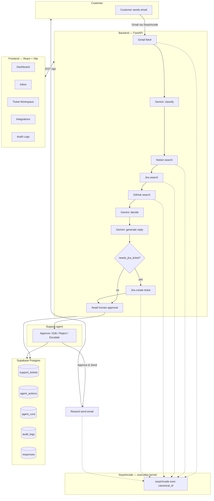

# Architecture

## System overview

## Components

### Frontend (`frontend/`)
React + TypeScript + Vite + Tailwind CSS, talking to the backend over a typed
REST client (`src/lib/api.ts`). Fully decoupled from the backend — runs
against any `VITE_API_URL`. Pages: Dashboard, Inbox, Ticket Workspace
(email, AI analysis, knowledge evidence, engineering issues, generated
reply, resolution graph, agent activity timeline, approval actions),
Integrations, Audit Logs.

### Backend (`backend/`)
FastAPI + Pydantic. Layered as:

- **`app/routers/`** — HTTP surface (tickets, dashboard, integrations, audit)
- **`app/services/orchestrator.py`** — the agent pipeline itself: fetch →
  classify → search Notion → search Jira → search GitHub → decide →
  generate reply → (create Jira ticket) → await approval. Every step is
  timed and recorded as an `AgentAction`.
- **`app/services/gemini_service.py`** — all Gemini calls use
  `response_schema` against Pydantic models (`EmailClassification`,
  `ResolutionDecision`, `GeneratedResponse`) so output is structured, never
  regex-parsed. Falls back to deterministic demo output with no API key.
- **`app/services/integrations_service.py`** — one function per external
  action (search Notion, search Jira, search GitHub, create Jira ticket,
  send email, fetch Gmail thread). Every function calls
  `SwytchcodeService.exec()` — nothing here talks to Notion/Jira/GitHub/
  Gmail/Resend directly.
- **`app/services/swytchcode_service.py`** — the only place that shells out
  to `swytchcode exec <canonical_id> --json`. Resolves logical action names
  (e.g. `"notion.search"`) to real canonical IDs via `tooling.json`, times
  every call, and returns a structured `SwytchcodeResult` for the audit
  trail. Refuses to call an unregistered tool rather than guessing an
  endpoint name.
- **`app/services/run_store.py`** — process-local store for agent runs,
  actions, responses, and the audit log (used directly in demo mode; a
  read-through cache in front of Supabase in live mode).

### Database (`supabase/`)
Postgres schema with 12 tables (`users`, `customers`, `support_tickets`,
`emails`, `ai_analyses`, `knowledge_sources`, `engineering_issues`,
`responses`, `agent_runs`, `agent_actions`, `audit_logs`,
`integration_status`), enums for status/priority/decision/health, RLS
policies for authenticated reads, and `supabase/seed.sql` with 5 demo
tickets.

### Execution layer (Swytchcode)
`tooling.json` at the project root is the trusted-tool policy file. It
starts with an empty `resolve_ai_action_map` — see the root README for the
exact `swytchcode add` commands to populate it with your workspace's real
canonical IDs before switching off demo mode.

## Data flow for one ticket

1. An inbound email is ingested as a `support_tickets` + `emails` row
   (in demo mode, from the 5 built-in fixtures).
2. Opening the ticket in the frontend triggers `GET /api/tickets/{id}`,
   which runs the orchestrator if no run exists yet.
3. Each pipeline step calls `SwytchcodeService.exec()`, producing one
   `agent_actions` row — this is what renders as the Agent Activity
   Timeline.
4. The pipeline ends in `awaiting_approval`; a `responses` row is created
   with `status = pending_approval`. Nothing is sent to the customer
   without an explicit human action.
5. **Approve & Send** calls `resend.send_email` through Swytchcode and
   flips the response to `sent`. **Reject** / **Escalate** / **Re-run AI**
   are all explicit, audited human actions.
